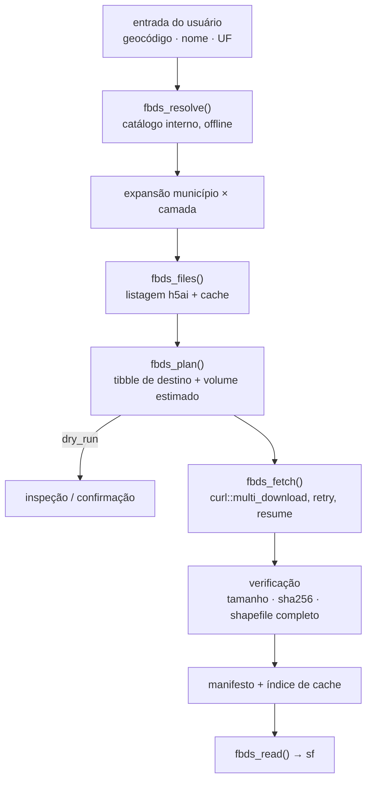

# SPECS — do repositório de scripts ao pacote R `geofbds`

Documento de projeto para transformar este repositório em um pacote R instalável.
Cobre (1) a avaliação do código atual, (2) a arquitetura de funções proposta e
(3) o fluxo de trabalho de download por município e por estado.

Status: proposta. Nada aqui foi implementado ainda.

---

## 1. Situação atual

| Arquivo | Papel | Avaliação |
| --- | --- | --- |
| `get-by-geocode.R` | Download por geocódigo, com validação, manifesto e retomada | Base sólida; é daqui que sai o núcleo do pacote |
| `get-full-geo-fbds-data.R` | Varredura nacional de links com `foreach`/`doParallel` | Exploratório; serve como fonte de requisitos (paralelismo, filtros de lixo do h5ai), não de código |
| `data/raw/TABELA CONSOLIDADA.xls` | Catálogo de 5.470 municípios (aba `Levantamento do Uso do Solo`) | Vira dado interno do pacote, não leitura em tempo de execução |
| `README.md` | Documentação de uso | Bem escrito; migra quase inteiro para `vignette` + `README` do pacote |

O portal expõe, por município, três diretórios: `APP`, `HIDROGRAFIA` e `USO`,
sob `https://geo.fbds.org.br/{UF}/{MUNICIPIO_SLUG}/{PASTA}`. As listagens são
geradas por h5ai.

---

## 2. Avaliação do código

### 2.1 O que já está certo e deve ser preservado

- **Separação de responsabilidades** em `get-by-geocode.R`: ler catálogo →
  validar → descobrir arquivos → baixar → registrar. Essa é exatamente a
  espinha dorsal do pacote.
- **Download atômico** via arquivo `.part` + `file.rename()`. Evita tratar
  transferência interrompida como completa.
- **Manifesto tabular** como valor de retorno *e* artefato em disco. É a
  decisão de design mais valiosa do projeto: dá auditoria, retomada e
  diagnóstico com `dplyr::count()`.
- **Idempotência** (`status = "existente"`) e continuação após erro por
  município, em vez de abortar a execução inteira.
- **Organização de saída por geocódigo/tipo**, que mantém juntos os
  componentes de cada shapefile e evita colisão de nomes entre municípios.
- **Uso de `::` em vez de `library()`** — já está no estilo de pacote.

### 2.2 Problemas que precisam ser corrigidos na migração

**Bloqueadores para virar pacote**

1. **Estado global avaliado no carregamento.** `catalogo_municipios` e
   `diretorio_padrao` chamam `here::here()` no topo do arquivo. Em um pacote
   isso é resolvido no momento do *build*, congelando o caminho da máquina de
   quem construiu. Substituir por funções (`fbds_cache_dir()`) e opções
   (`getOption("geofbds.base_url")`).
2. **Escrita fora de `tempdir()` sem consentimento.** Política do CRAN: o
   destino padrão precisa ser `tools::R_user_dir("geofbds", "cache")` com
   confirmação no primeiro uso, e não `data/raw/geo-fbds`.
3. **Leitura de `.xls` em tempo de execução.** Arrasta `readxl` e `janitor`
   para `Imports` e torna o pacote dependente de um arquivo que o usuário não
   tem. O catálogo deve ser um dataset interno gerado em `data-raw/`.
4. **Bloco `if (sys.nframe() == 0L)`** não existe em pacote. Vira
   `inst/exec/geofbds` (ou script em `inst/scripts/`).
5. **`get-full-geo-fbds-data.R` depende de `misc::view_vd()`**, pacote pessoal
   não público, e de `library(tidyverse)`. Esse arquivo não migra; é
   aposentado depois que o paralelismo estiver coberto pelo pacote.

**Bugs e fragilidades reais**

6. **`tidyr::crossing()` ordena o resultado.** Em `descobrir_arquivos_fbds()`,
   o `crossing()` desfaz silenciosamente a ordenação cuidadosamente construída
   por `ordem`/`match()` em `baixar_dados_fbds()`. Usar `tidyr::expand_grid()`
   (não ordena) ou reaplicar a ordem depois.
7. **Subdiretórios são descartados sem aviso.** O filtro
   `!stringr::str_ends(url, "/")` remove entradas de diretório — o que é
   correto para não baixar links de pasta, mas significa que o conteúdo de
   `USO/MAPAS` (visível no script antigo) nunca é baixado, e nada informa isso
   ao usuário. Precisa de um argumento `recursive`.
8. **Ausência de verificação de integridade.** `status = "existente"` é
   decidido só por `file.exists()`; um arquivo truncado por uma execução
   antiga (ou por versão anterior do script, sem `.part`) é aceito como bom.
   Comparar com o tamanho anunciado na listagem e/ou `Content-Length`.
9. **Sem retry, backoff ou timeout explícito.** Um `500` transitório vira erro
   permanente no manifesto. Em varredura estadual (853 municípios em MG),
   isso é a diferença entre uma execução e cinco.
10. **Shapefile é tratado como arquivo, não como conjunto.** Um `.shp` sem
    `.shx`/`.dbf`/`.prj` é inútil, mas o manifesto marca cada componente como
    sucesso independente. Faltam validação e conceito de *shapefile set*.
11. **Sem codificação de URL.** `paste(url, uf, slug, pasta, sep = "/")` assume
    que o slug é ASCII seguro. Vale enquanto `make_clean_names()` garantir
    isso, mas é uma suposição não verificada — ver §7.
12. **`sprintf("%.0f", ...)` sobre geocódigo numérico.** Funciona, mas silencia
    `NA` (vira `"NA"`) e depende da coluna vir como `numeric`. O catálogo
    congelado resolve isso na origem.
13. **`manifesto.csv` é sobrescrito a cada execução** na raiz do diretório de
    saída, misturando o resultado de downloads diferentes.
14. **Download estritamente sequencial.** Aceitável para 2 municípios,
    inviável para uma UF. O script antigo já provou que paralelismo é
    necessário.

**Higiene de código**

15. `dplyr::select(.data$arquivo, .data$url_download)` — `.data` em contexto
    *tidyselect* está depreciado desde tidyselect 1.2. Usar nomes nus ou
    `all_of()`. (Em contexto de *data masking*, como `mutate()`/`filter()`,
    `.data$` continua correto.)
16. `dplyr::transmute()` está superseded; preferir `mutate() |> select()`.
17. Mensagens via `message()`/`warning()` — migrar para `cli` (progresso,
    formatação, condições classificadas).
18. Erros não são condições classificadas. `rlang::abort(class = "fbds_http_error")`
    permite `tryCatch()` seletivo pelo usuário e testes precisos.
19. Nenhum teste, nenhum `R CMD check`, nenhuma CI.

---

## 3. Decisões de projeto

| Decisão | Escolha | Motivo |
| --- | --- | --- |
| Nome do pacote | `geofbds` | Minúsculas, sem pontos; alinhado a `geobr`, `censobr` |
| Idioma da API | Inglês (`fbds_download_state()`) | Convenção do ecossistema R/CRAN; documentação e mensagens em português |
| Prefixo | `fbds_` em tudo que é exportado | Autocomplete descobrível, sem colisão |
| Catálogo | Dataset interno congelado | Sem I/O de `.xls` em runtime, sem dependência de arquivo externo |
| Motor HTTP | `curl::multi_download()` | Paralelismo, `resume = TRUE`, progresso e status por arquivo — substitui o laço manual e a lógica `.part` |
| Destino padrão | `tools::R_user_dir("geofbds", "cache")` | Política CRAN; cache compartilhado entre projetos |
| Retorno | Sempre tibble (manifesto) | Mantém a melhor ideia do código atual |

> Se você preferir manter a API em português (`fbds_baixar_estado()`), o
> desenho abaixo se traduz 1:1 — só a tabela de nomes muda. É a única decisão
> deste documento que eu deixaria explicitamente para você.

---

## 4. Estrutura de funções

Quatro camadas, com dependência só para baixo. Cada camada é testável sozinha;
as camadas 1 e 4 não tocam a rede.

```
┌─ 4. Leitura (sf) ──── fbds_read()  fbds_get()
├─ 3. Download ───────── fbds_plan()  fbds_fetch()  fbds_download_*()
├─ 2. Descoberta ─────── fbds_files()  fbds_coverage()
└─ 1. Catálogo ───────── fbds_catalog()  fbds_resolve()  fbds_layers()  fbds_url()
```

### Camada 1 — Catálogo (offline)

| Função | Assinatura | Retorno |
| --- | --- | --- |
| `fbds_catalog()` | `(uf = NULL, name = NULL, geocode = NULL)` | tibble do catálogo filtrado |
| `fbds_resolve()` | `(x, uf = NULL, strict = TRUE)` | vetor de geocódigos canônicos |
| `fbds_layers()` | `()` | tibble: `layer`, `dir`, `description` |
| `fbds_url()` | `(geocode, layer = NULL)` | URLs do portal |
| `fbds_ufs()` | `()` | 27 UFs com contagem de municípios |

`fbds_resolve()` é o ponto de entrada universal: aceita geocódigo numérico ou
texto, nome de município (sem acento, caixa indiferente) e forma
`"Cabixi/RO"`. Ambiguidade (`"Bom Jesus"` existe em várias UFs) gera erro
classificado listando os candidatos — nunca escolha silenciosa.

Dataset interno `fbds_municipios`: `geocode` (chr, 7 dígitos), `municipality`,
`uf`, `uf_code`, `slug` (o segmento de URL **verificado**), `slug_status`,
mais as colunas de área por classe de uso já presentes na planilha.

### Camada 2 — Descoberta (rede, somente leitura)

| Função | Assinatura | Retorno |
| --- | --- | --- |
| `fbds_files()` | `(x, layers = NULL, recursive = FALSE, cache = TRUE)` | tibble: `geocode`, `uf`, `municipality`, `layer`, `path`, `file`, `ext`, `bytes`, `modified`, `url` |
| `fbds_coverage()` | `(uf = NULL, layers = NULL)` | uma linha por município × camada: `n_files`, `bytes`, `has_shapefile`, `complete` |

Parsear **tamanho e data** da tabela h5ai é o que permite estimar o volume
antes de baixar uma UF inteira, sem disparar milhares de requisições `HEAD`.
Listagens ficam em cache (memoização na sessão + cache em disco com TTL
configurável), porque uma varredura estadual repete as mesmas páginas.

### Camada 3 — Download

```r
fbds_plan(x, layers = NULL, dest_dir = fbds_cache_dir(), recursive = FALSE,
          skip_existing = TRUE, path_pattern = "{uf}/{geocode}/{layer}/{file}")
# → objeto <fbds_plan>: tibble + metadados; print() mostra n arquivos e volume

fbds_fetch(plan, workers = 4, retries = 3, timeout = 300,
           progress = TRUE, dry_run = FALSE)
# → manifesto (tibble), grava manifesto versionado e atualiza o índice de cache
```

Separar **planejar** de **executar** resolve três problemas de uma vez:
`dry_run` de verdade, estimativa de volume antes de aceitar uma UF inteira, e
testabilidade (o planejamento não toca a rede além da listagem já cacheada).

Atalhos, que são o que o usuário chama no dia a dia:

```r
fbds_download_municipality(geocode, layers = NULL, ...)  # 1..n municípios
fbds_download_state(uf, layers = NULL, ..., ask = interactive())
fbds_download_all(..., ask = interactive())              # opt-in explícito
```

Todos são invólucros finos de `fbds_plan() |> fbds_fetch()` e devolvem o mesmo
manifesto. `fbds_download_state()` acrescenta: estimativa prévia de volume com
confirmação, execução em blocos por município, e arquivo de progresso
(`_progress.csv`) no destino, de modo que uma execução interrompida na
metade de Minas Gerais retome de onde parou.

Manifesto (uma linha por arquivo): `run_id`, `geocode`, `uf`, `municipality`,
`layer`, `file`, `url`, `path`, `status` (`downloaded` | `cached` | `failed` |
`skipped`), `bytes`, `expected_bytes`, `sha256`, `http_status`, `attempts`,
`error`, `timestamp`. É o `manifesto.csv` atual, com as colunas que faltam
para auditoria e integridade.

### Camada 4 — Leitura e cache

| Função | Propósito |
| --- | --- |
| `fbds_read(x, layer, type = NULL, crs = NULL)` | lê para `sf`; empilha municípios; harmoniza CRS e encoding do `.dbf` |
| `fbds_get(x, layer, ...)` | `download` + `read` em um passo (padrão `geobr`) |
| `fbds_cache_dir()` / `fbds_cache_set()` | consulta e define o cache |
| `fbds_cache_status()` / `fbds_cache_clean()` | inventário e limpeza |
| `fbds_validate(manifest)` | conferência de integridade e de conjuntos de shapefile |

`sf` entra em `Suggests`, não em `Imports`: quem só quer baixar não deve
precisar do GDAL.

### Internas (não exportadas)

`fbds_request()` (retry + backoff + user-agent), `list_remote_dir()`,
`parse_h5ai_listing()`, `municipality_slug()`, `shapefile_sets()`,
`write_manifest()`, `resume_state()`, `abort_fbds()`.

### Opções

`geofbds.base_url`, `geofbds.cache_dir`, `geofbds.workers` (padrão 4),
`geofbds.timeout`, `geofbds.retries`, `geofbds.user_agent`, `geofbds.progress`,
`geofbds.quiet`.

---

## 5. Fluxo de trabalho



### Por município

```r
library(geofbds)

# o que existe antes de baixar
fbds_files(c("1100031", "1100049"))

# baixar
m <- fbds_download_municipality(c("1100031", "1100049"))
dplyr::count(m, status)

# ler
app <- fbds_read(m, layer = "app")
```

Nome também funciona: `fbds_download_municipality("Cabixi/RO")`.

### Por estado

```r
# 1. dimensionar
fbds_coverage("RO")                     # 52 municípios, cobertura por camada
plano <- fbds_plan("RO", layers = "app")
plano                                   # print: 52 municípios · N arquivos · X GB

# 2. executar (confirma se passar do limite)
ro <- fbds_fetch(plano, workers = 6)

# 3. retomar, se cair
ro <- fbds_download_state("RO", layers = "app")   # reaproveita _progress.csv

# 4. ler tudo empilhado
app_ro <- fbds_read(ro, layer = "app")
```

`fbds_download_state()` aceita mais de uma UF e `layers = NULL` (todas).
`fbds_download_all()` existe para o espelho nacional, mas exige confirmação
explícita e é documentado com o volume envolvido.

### Linha de comando

`inst/exec/geofbds` preserva a ergonomia atual e ganha o modo estadual:

```bash
geofbds municipality 1100031 1100049 --layers app,uso --dest data/raw/geo-fbds
geofbds state RO --workers 6
geofbds files RO --dry-run
```

---

## 6. Estrutura do repositório

```text
geofbds/
├── DESCRIPTION
├── NAMESPACE
├── LICENSE.md
├── R/
│   ├── geofbds-package.R      # docs do pacote, imports, .onLoad
│   ├── catalog.R              # fbds_catalog, fbds_resolve, fbds_layers, fbds_url
│   ├── discover.R             # fbds_files, fbds_coverage, parse_h5ai_listing
│   ├── plan.R                 # fbds_plan, métodos print/format
│   ├── fetch.R                # fbds_fetch, retry, resume
│   ├── download.R             # atalhos por município / estado / nacional
│   ├── read.R                 # fbds_read, fbds_get
│   ├── cache.R                # cache dir, índice, limpeza
│   ├── manifest.R             # escrita, validação, shapefile sets
│   ├── http.R                 # fbds_request, user-agent, backoff
│   ├── conditions.R           # abort_fbds e classes de erro
│   └── utils.R
├── data/
│   └── fbds_municipios.rda
├── data-raw/
│   ├── TABELA CONSOLIDADA.xls
│   ├── build_catalog.R        # xls → tibble limpo → use_data()
│   └── verify_slugs.R         # confere cada slug contra o portal (manutenção)
├── inst/
│   └── exec/geofbds
├── man/
├── tests/testthat/
│   ├── fixtures/              # HTML de listagem h5ai gravado
│   └── test-*.R
├── vignettes/
│   ├── geofbds.Rmd            # uso básico
│   └── estados.Rmd            # download em escala
└── .github/workflows/R-CMD-check.yaml
```

**DESCRIPTION**

- `Imports`: `cli`, `curl (>= 5.0.0)`, `dplyr`, `rlang`, `rvest`, `tibble`,
  `tidyr`, `vroom`, `withr`, `xml2`
- `Suggests`: `sf`, `testthat (>= 3.0.0)`, `httptest2`/`webfakes`, `knitr`,
  `rmarkdown`
- Saem de cena: `tidyverse`, `here`, `glue`, `textclean`, `readxl`, `janitor`,
  `tictoc`, `foreach`, `doParallel`, `misc` (as três últimas substituídas por
  `curl::multi_download()`; `readxl`/`janitor` ficam só em `data-raw/`)

---

## 7. Suposições e verificações pendentes

Não foi possível alcançar `geo.fbds.org.br` durante a redação deste documento
(timeout), então os pontos abaixo vêm do código existente e precisam de
confirmação antes da implementação:

1. **O slug de URL do município.** Hoje é
   `str_to_upper(make_clean_names(municipio))`, ou seja
   `ALTA FLORESTA D'OESTE` → `ALTA_FLORESTA_D_OESTE`. Precisa ser validado
   município a município; o resultado vira a coluna `slug` congelada no
   dataset, com `slug_status` registrando os que não resolvem. Esse é o maior
   risco técnico do pacote: uma regra derivada em runtime quebra em silêncio,
   uma tabela verificada não.
2. **Formato da listagem h5ai** — se a tabela expõe tamanho e data em HTML ou
   só via JavaScript. Se for só via JS, a alternativa é o endpoint JSON do
   h5ai (`?action=get`), e `fbds_coverage()` passa a usar `HEAD`.
3. **Subdiretórios sob `USO`** (`MAPAS`, `info`) e a existência de `USO.rar` —
   definem o comportamento padrão de `recursive` e a lista de exclusão.
4. **Termos de uso e licença dos dados da FBDS**, para citar corretamente em
   `README`, vinheta e `inst/CITATION`, e para calibrar o padrão de
   paralelismo (`workers = 4` é uma escolha conservadora até sabermos).
5. **Cobertura real** — os 5.470 municípios da planilha são a lista de
   levantamento, não necessariamente o que está publicado. `fbds_coverage()`
   existe justamente para medir isso.

---

## 8. Roteiro

| Fase | Entrega | Critério de pronto |
| --- | --- | --- |
| 0 | Esqueleto do pacote, `DESCRIPTION`, licença, CI | `R CMD check` limpo em pacote vazio |
| 1 | Catálogo: `data-raw/build_catalog.R`, dataset, camada 1 | `fbds_resolve()` resolve geocódigo e nome; testes offline |
| 2 | Verificação de slugs contra o portal | `slug` congelado, cobertura conhecida |
| 3 | Descoberta: `fbds_files()`, `fbds_coverage()`, cache de listagem | testes com fixtures HTML gravadas |
| 4 | Download por município: `fbds_plan()`, `fbds_fetch()`, manifesto | paridade funcional com `get-by-geocode.R` |
| 5 | Download por estado: retomada, paralelismo, confirmação de volume | uma UF completa baixada e retomada após interrupção |
| 6 | Leitura: `fbds_read()`, `fbds_get()` | `sf` empilhado com CRS e encoding corretos |
| 7 | CLI, vinhetas, `pkgdown`, `CITATION` | `README` do pacote substitui o atual |
| 8 | Aposentar `get-full-geo-fbds-data.R` | funcionalidade coberta pelo pacote |

As fases 1–4 já entregam um pacote útil; 5 é o que este repositório ainda não
faz e é o ganho principal da migração.
