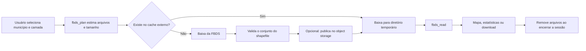

# Plano arquitetural para um aplicativo Shiny da Geo FBDS

## Objetivo

Construir um aplicativo Shiny para exploração rápida dos dados geoespaciais
municipais disponibilizados pela Geo FBDS, sem depender do sistema de arquivos
local do ambiente de hospedagem para persistência.

A decisão central é separar:

- **dados temporários da sessão**, necessários apenas para executar uma consulta;
- **cache persistente compartilhado**, opcional e mantido fora do Shiny;
- **artefatos otimizados para visualização**, caso o volume dos shapefiles se
  torne um gargalo.

O armazenamento persistente não precisa ser resolvido na primeira versão. Os
dados da FBDS são reproduzíveis e podem ser baixados novamente; no MVP, a
persistência é uma otimização de desempenho, não um requisito de correção.

## Restrições do shinyapps.io

O shinyapps.io permite que uma aplicação leia e escreva no sistema de arquivos
local, mas esse armazenamento é efêmero:

- arquivos podem desaparecer quando a aplicação dorme, reinicia ou é recriada;
- um novo deploy substitui as instâncias anteriores;
- instâncias diferentes da mesma aplicação não compartilham arquivos;
- portanto, o disco local não pode ser usado como cache persistente ou fonte de
  verdade.

A instância padrão possui 1 GB de memória. Para dados espaciais, a memória tende
a ser uma restrição mais importante que o espaço em disco, porque um shapefile
carregado como objeto `sf` pode ocupar consideravelmente mais memória do que os
arquivos originais.

Referências oficiais:

- [Storage](https://docs.posit.co/shinyapps.io/guide/storage/)
- [Applications](https://docs.posit.co/shinyapps.io/guide/applications/)
- [Security and Compliance](https://docs.posit.co/shinyapps.io/guide/security_and_compliance/)

## Arquitetura proposta



## Etapa 1 — MVP com armazenamento temporário

A primeira versão deve usar um diretório temporário exclusivo para cada sessão.

Fluxo:

1. o usuário escolhe município, camada e tipo;
2. `fbds_plan()` identifica os arquivos e mostra o tamanho esperado;
3. o aplicativo verifica os limites permitidos;
4. `fbds_fetch()` baixa os arquivos para o diretório da sessão;
5. `fbds_read()` carrega o conjunto validado;
6. o aplicativo apresenta o mapa, estatísticas ou um download;
7. o diretório é removido quando a sessão termina.

Esse desenho evita colisões entre usuários e não pressupõe que o disco local
sobreviverá à instância.

### Controles necessários

A primeira versão deve impor limites explícitos:

- um município por consulta;
- uma camada e um tipo por operação;
- limite de tamanho previsto, inicialmente entre 100 e 300 MB;
- limite de número de feições após a leitura;
- download iniciado por uma ação explícita do usuário, não automaticamente por
  uma expressão reativa;
- diretório independente por sessão;
- limpeza registrada com `session$onSessionEnded()`;
- mensagens de progresso para descoberta, download, validação, leitura e
  transformação;
- tratamento de falha parcial sem deixar conjuntos incompletos disponíveis;
- rejeição antecipada de consultas maiores que os recursos da instância.

O objeto `sf` completo não deve ser enviado ao navegador indiscriminadamente.
Para conjuntos grandes, o servidor deve simplificar, agregar ou recortar os
dados antes da renderização.

## Etapa 2 — Cache persistente externo

Um cache externo deve ser adicionado somente se as métricas mostrarem consultas
repetidas aos mesmos municípios e camadas.

Opções adequadas:

- Amazon S3;
- Cloudflare R2;
- Backblaze B2;
- Google Cloud Storage.

Object storage é mais apropriado que um banco relacional para guardar os
arquivos originais da FBDS.

### Organização dos objetos

A chave deve identificar o município, camada, tipo e versão observada no
portal:

```text
{geocode}/{layer}/{type}/{upstream-version}.zip
```

Exemplo:

```text
3205309/hidrografia/NASCENTES/2023-08-22.zip
```

Cada objeto deve conter o conjunto completo do shapefile:

```text
.shp
.shx
.dbf
.prj
.cpg
```

Armazenar um ZIP único torna a publicação atômica e evita disponibilizar um
shapefile parcial.

### Fluxo com cache

1. construir uma chave estável para a consulta;
2. verificar se o ZIP existe no armazenamento externo;
3. em caso de acerto, baixá-lo para o diretório temporário e extrair;
4. em caso de falta, baixar da FBDS e validar o conjunto;
5. publicar o ZIP validado no armazenamento externo;
6. ler sempre a partir da cópia temporária local;
7. remover a cópia ao encerrar a sessão.

Falhas concorrentes de cache podem ser tratadas com uma operação idempotente:
dois workers podem produzir o mesmo objeto, desde que a chave represente o
mesmo conteúdo e o objeto só seja publicado após validação completa.

### Requisitos operacionais

O cache externo deve usar:

- objetos privados;
- credenciais fornecidas por variáveis de ambiente, nunca pelo código;
- permissões mínimas de leitura e escrita;
- política de expiração, por exemplo 30 ou 90 dias;
- versão baseada em `modified`, tamanho anunciado ou checksum;
- metadados com URL original, data de captura e checksum;
- limite global de armazenamento e observabilidade de custos.

Antes de espelhar dados em escala, devem ser conferidas as condições aplicáveis
à redistribuição e ao armazenamento de cópias do portal.

## Etapa 3 — Formatos otimizados para visualização

Se o objetivo principal for visualização cartográfica, processar os shapefiles
brutos em cada consulta não será a solução mais eficiente.

Uma rotina offline pode produzir:

- FlatGeobuf;
- GeoParquet;
- geometrias simplificadas em diferentes resoluções;
- vector tiles ou PMTiles.

Estrutura possível:

```text
original/
  3205309/hidrografia/NASCENTES.zip

derived/
  3205309/hidrografia/NASCENTES.parquet
  3205309/hidrografia/NASCENTES-low.fgb
  3205309/hidrografia/NASCENTES.pmtiles
```

Com artefatos derivados, a aplicação pode transferir apenas as feições ou os
tiles necessários para a área e o nível de zoom visíveis. Isso reduz:

- tempo de download;
- memória do processo R;
- volume enviado ao navegador;
- processamento repetido de conversão e simplificação;
- tempo de resposta para consultas frequentes.

Os arquivos derivados podem ser servidos diretamente por object storage e CDN,
sem atravessar o processo R quando não houver lógica de negócio necessária.

## Quando usar PostGIS

PostGIS passa a ser adequado se o aplicativo precisar:

- consultar vários municípios simultaneamente;
- filtrar atributos em milhões de feições;
- recortar por bacia ou por polígono enviado pelo usuário;
- executar interseções e agregações espaciais;
- pesquisar nacionalmente sem baixar arquivos completos;
- compartilhar resultados consistentes entre múltiplas instâncias.

Nesse cenário, uma rotina externa importa e atualiza os dados da FBDS. O Shiny
executa consultas e recebe somente o subconjunto necessário.

Para selecionar um município e uma camada e então visualizá-los, PostGIS seria
complexidade operacional prematura.

## Alternativa: hospedagem própria

Uma máquina virtual com Shiny Server ou Posit Connect e volume persistente
permite reutilizar o cache local do pacote com menos mudanças arquiteturais.

Vantagens:

- controle sobre disco, memória e CPU;
- cache local persistente;
- liberdade para instalar bibliotecas do sistema;
- possibilidade de executar tarefas agendadas.

Custos:

- administração do servidor;
- atualizações e segurança;
- backups;
- monitoramento;
- escalabilidade e alta disponibilidade por conta do mantenedor.

Essa alternativa é razoável quando se deseja controle operacional, mas não é
necessária para validar o produto.

## Comparação das estratégias

| Estratégia | Complexidade | Persistência | Escala | Uso indicado |
|---|---:|---:|---:|---|
| Temporário por sessão | Baixa | Não | Baixa/média | MVP |
| Cache S3/R2 | Média | Sim | Média/alta | Aplicativo público |
| GeoParquet/tiles pré-processados | Média/alta | Sim | Alta | Exploração cartográfica |
| PostGIS | Alta | Sim | Alta | Consultas e análises espaciais |
| VPS com disco persistente | Média | Sim | Depende da máquina | Controle total |

## Métricas para orientar a evolução

O MVP deve registrar, sem dados pessoais desnecessários:

- município, camada e tipo consultados;
- número e tamanho dos arquivos planejados;
- duração da descoberta, download, leitura e renderização;
- número de feições carregadas;
- pico aproximado de memória;
- consultas recusadas por limite;
- falhas de rede ou de validação;
- taxa de repetição das mesmas chaves de dados.

Essas métricas determinam se o próximo investimento deve ser cache externo,
simplificação, tiles ou banco espacial.

## Sequência recomendada

1. Implementar o MVP no shinyapps.io com diretórios temporários por sessão.
2. Impor limites de tamanho, feições e escopo antes do download.
3. Medir comportamento real e consultas repetidas.
4. Adicionar cache S3-compatible apenas quando a repetição justificar.
5. Adotar formatos otimizados ou tiles se a renderização for o gargalo.
6. Adotar PostGIS somente se o produto evoluir para consultas espaciais
   nacionais ou análises entre conjuntos.

A responsabilidade arquitetural deve permanecer clara: o shinyapps.io executa
a interface e as consultas; qualquer persistência necessária fica em um serviço
externo apropriado.
