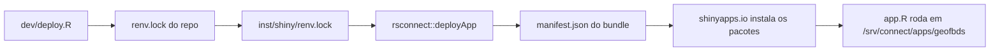

# Deploy no shinyapps.io: o servidor nunca instalava o `geofbds` publicado

Relato do problema que manteve o aplicativo `geofbds` quebrado no shinyapps.io
mesmo depois de a correção estar publicada no GitHub, e do que foi mudado em
`dev/deploy.R` para resolver.

## Sintoma

O aplicativo subia e morria em menos de um segundo, sempre com o mesmo erro:

```
Shiny application starting ...
Error in geofbds::fbds_catalog() : object 'fbds_municipios' not found
Calls: local ... tryCatch -> tryCatchList -> tryCatchOne -> <Anonymous>
Execution halted
```

Era exatamente o erro já corrigido no pacote (`a838429`, "fix: bind the
municipality catalog to the namespace"): `fbds_municipios` mora em `data/`, que
só entra no caminho de busca quando o pacote é anexado por `library()`, e o
aplicativo chama `geofbds::fbds_catalog()`. O commit publicado continha a
correção e instalá-lo do GitHub localmente funcionava:

```bash
curl -sSL -o pkg.tar.gz \
  https://github.com/kguidonimartins/geofbds/archive/2a12c0bd10a72d32f6cc5504b7a1d61c73b59a32.tar.gz
R CMD INSTALL -l "$L" geofbds-2a12c0bd...
R_LIBS="$L" Rscript -e 'geofbds::fbds_catalog(name = "cabixi")'   # funciona
```

Ou seja: o código certo existia no remote; o servidor não estava rodando esse
código.

## Como o deploy deste repositório funciona



O bundle enviado tem três arquivos (`app.R`, `helpers.R`, `renv.lock`) e um
`manifest.json` gerado a partir do `renv.lock`. **É o `manifest.json` — não o
`renv.lock` — que determina o que o servidor instala.** O `renv.lock` viaja no
bundle, mas quem reconstrói o ambiente é o registro de pacotes do manifest.

## Diagnóstico

### 1. A referência do `renv.lock` estava velha

`renv.lock` grava o commit que estava instalado quando rodou
`renv::snapshot()`, e a cópia para `inst/shiny` era apagada no fim do deploy,
então nada atualizava o registro: o arquivo fixava `6e51e2f`, de *antes* da
correção.

Corrigido em `d244de5`: o deploy lê o HEAD do remote pelos campos do próprio
registro (`git ls-remote https://<host>/<user>/<repo>.git HEAD`) e reescreve
`RemoteRef`/`RemoteSha` na cópia. Necessário, mas **não suficiente** — o
problema continuou.

### 2. O `manifest.json` não dizia qual commit instalar

Inspeção do manifest gerado localmente (`rsconnect::writeManifest()` sobre uma
cópia do app dir com o `renv.lock` corrigido):

```json
"geofbds": {"Source": "github", "Repository": null, "description": { ... }}
```

- Sem `Repository`, sem SHA, e o `description` (o DESCRIPTION do pacote
  instalado na máquina que publica) **sem nenhum campo `Remote*`/`Github*`**.
- Para os pacotes de CRAN o `description` traz `RemoteType: standard`,
  `RemoteSha: <versão>` etc. — vindos do DESCRIPTION gravado pelo
  `install.packages()`.

O motivo está em `rsconnect:::standardizeRenvPackage()` +
`manifestPackageColumns()`: para `Source == "GitHub"` o registro do
`renv.lock` é preservado, mas na hora de montar o manifest só sobrevivem
`Package`, `Version`, `Source`, `Repository` e colunas `^Github`. Os campos
`RemoteUsername`/`RemoteRepo`/`RemoteRef`/`RemoteSha` do `renv.lock` (formato
do renv) são **descartados**, e o renv não grava `Github*`.

### 3. Contraprova

Instalando o mesmo commit com um instalador que carimba a procedência
(`pak::pkg_install("kguidonimartins/geofbds@2a12c0bd...")`) e regerando o
manifest, o registro passa a levar tudo o que o servidor precisa:

```
description$RemoteType     = github
description$RemoteHost     = api.github.com
description$RemoteRepo     = geofbds
description$RemoteUsername = kguidonimartins
description$RemoteRef      = 2a12c0bd10a72d32f6cc5504b7a1d61c73b59a32
description$RemoteSha      = 2a12c0bd10a72d32f6cc5504b7a1d61c73b59a32
description$GithubRepo     = geofbds
description$GithubUsername = kguidonimartins
description$GithubRef      = 2a12c0bd10a72d32f6cc5504b7a1d61c73b59a32
description$GithubSHA1     = 2a12c0bd10a72d32f6cc5504b7a1d61c73b59a32
```

## Causa raiz

O `geofbds` instalado na máquina que publica estava instalado **do diretório
local** (`R CMD INSTALL .`, `load_all()`). Instalações desse tipo não têm os
campos `GithubRepo`/`GithubUsername`/`GithubRef`/`GithubSHA1` no DESCRIPTION, e
é só deles que o servidor dispõe para reinstalar um pacote `Source: github`
(o instalador do Connect/shinyapps.io é baseado em packrat, e
`packrat:::inferPackageRecord()` lê exatamente esses quatro campos).

Sem procedência e sem SHA, o servidor não tinha commit para buscar e
reaproveitava um build antigo de `geofbds 0.0.0.9000` — a versão não muda entre
commits neste pacote, o que tornava o sintoma permanente e enganoso: o
`renv.lock` estava certo, o código publicado estava certo, e mesmo assim o
aplicativo rodava o pacote velho.

Caso semelhante relatado no fórum da Posit ("Posit Connect Cloud ignores
renv.lock RemoteSha and always installs old GitHub commit", tópico 213411), com
a mesma conclusão: o manifest só captura `GithubSHA1`/`RemoteSha` se o pacote
tiver sido instalado por um instalador que grava esses campos (ex.
`remotes::install_github()`) no momento da geração.

## Correção (`d6a80f4`)

`dev/deploy.R` agora instala o commit publicado antes de montar o bundle:

```r
sha <- remote_head_sha(lockfile)          # d244de5
install_published_geofbds(lockfile, sha)  # d6a80f4
set_lockfile_ref(app_lockfile, sha)
```

`install_published_geofbds()`:

- instala `user/repo@sha` com `pak::pkg_install(..., lib = <lib temporária>,
  dependencies = FALSE)`. **`dependencies = FALSE` é essencial**: sem ele, as
  dependências recém-instaladas (versões mais novas que as do `renv.lock`)
  passam à frente no `.libPaths()` e o rsconnect aborta com
  `Library and lockfile are out of sync` (`rsconnect:::parseRenvDependencies()`);
- prepende a biblioteca ao `.libPaths()`, para que `packageDescription()` na
  geração do manifest resolva o pacote publicado;
- falha com erro explícito se o pacote instalado não registrar o commit
  esperado (`GithubSHA1`), em vez de publicar um bundle que o servidor não
  consegue reconstruir.

O `d244de5` continua sendo necessário: mantém o `renv.lock` do bundle coerente
com o commit que o manifest vai instalar.

## Verificação

- `make deploy` → task `1744038802` `application-deploy: success`
  (`1744038803` `image-build: success`).
- Log do aplicativo em produção:

  ```
  Shiny application starting ...
  [geofbds-shiny] event=app_loaded municipalities=5470 max_bytes=262144000 max_features=250000
  Listening on http://127.0.0.1:38731
  ```

- `GET https://kguidonimartins.shinyapps.io/geofbds/` → `http=200`, página com
  `id="municipality"` e os inputs renderizados. O erro `object
  'fbds_municipios' not found` não aparece mais.
- Verificação local equivalente, sem publicar: rodar
  `rsconnect::writeManifest()` com o pacote publicado em `.libPaths()` e
  conferir `description$GithubSHA1` no manifest (ver "Contraprova").

## Efeitos colaterais observados

- **Custo de um deploy após mudar o commit**: o registro do pacote muda, o
  cache de imagem é invalidado e o servidor recompila as dependências do zero.
  O primeiro deploy depois da correção levou ~45 min (compilação de `s2`, `sf`
  etc.); com o mesmo SHA, o deploy volta a levar poucos minutos.
- **Deploy interrompido**: matar o processo local não cancela a task no
  servidor. Enquanto ela estiver `building`, um novo `deployApp` falha com
  `Unable to dispatch task for application=... as there are 1 tasks already in
  progress`. Verifique com
  `rsconnect:::tasks(account = "kguidonimartins")` (a lista vem em ordem
  decrescente de criação; as tasks novas estão no topo) e
  `rsconnect:::taskLog("<id>", account = "kguidonimartins")`.
- **Artefato residual**: o `unlink()` do `inst/shiny/renv.lock` está no
  `finally`, que não roda se o processo for morto — remova o arquivo antes de
  tentar de novo (`file.copy(..., overwrite = FALSE)` falha se ele existir).
- **Aviso de HEAD divergente**: o app roda o `geofbds` *publicado*, então
  `push` antes de `make deploy`; o script avisa quando o HEAD local está à
  frente do remote.

## O que não era a causa

- Falta de `push` — os commits da correção estavam no `origin/main`.
- `renv.lock` desatualizado — era parte do problema (`d244de5`), mas corrigir
  só ele não mudou o comportamento do servidor.
- Cache de navegador, versão do R ou `LazyData` — o pacote publicado instalava
  e resolvia o catálogo normalmente fora do servidor.
